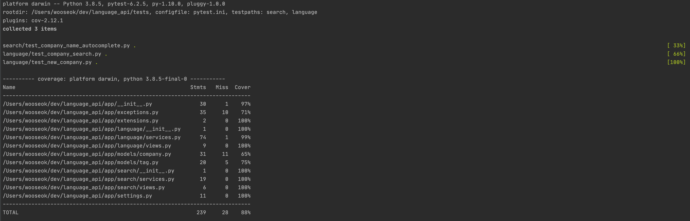

# language_api

## 1. 기본세팅
- 도커는 고정아이피로 세팅(앱이 DB를 바라보게 하기위함)
- 모든 중요 변수들은 환경변수로 관리(dotenv)
- 데이터 베이스 - mysql
    - docker compose를 통하여 컨테이너로 동작중
    - 서버가 시작될때 데이터베이스가 구동하며 종료되면 DB 유실
    - 서버를 실행할때 데이터 베이스 DROP and INSERT
- 디자인 패턴 : mvc pattern 적용
- 앱(flask기반)
    - docker compose를 통하여 컨테이너로 서버 동작중
    - port : 5000, host : 0.0.0.0
    - http://127.0.0.1:5000/search?query=링크 이와같은 링크 바라보면됨

### 1 - 1 테스트 하는방법
****
기본적으로 도커가 설치되어 있어야합니다.
****
- python3.8 -m virtualenv venv (가상환경 설치)
- source venv/bin/activate (가상환경 구동)
- pip install -r requirements.txt (패키지 의존성 설치)
- make build (도커 컴포즈 빌드)

### 1 - 2 테스트 코드 구동
- cd tests
- python -m pytest --cov=../app

